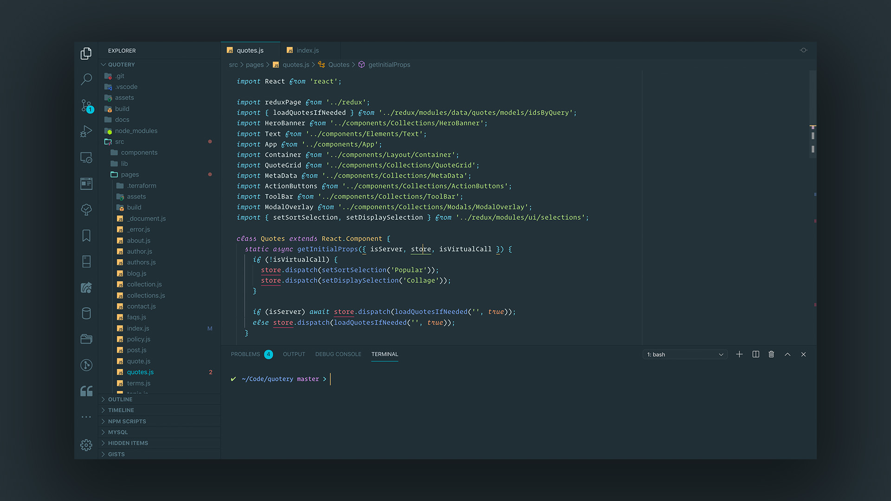

# Material Pro (VSCode)

[](https://marketplace.visualstudio.com/items?itemName=jabacchetta.material-pro)
[](https://marketplace.visualstudio.com/items?itemName=jabacchetta.material-pro)
[](https://marketplace.visualstudio.com/items?itemName=jabacchetta.material-pro)

## Introduction

[Material Pro](https://marketplace.visualstudio.com/items?itemName=jabacchetta.material-pro) is a
color theme for VSCode that delivers visual pop while keeping distractions to a minimum and drawing
attention to what's most important — the code itself.

The syntax colors were selected based on their contrast and energetic impressions, and are inspired
by the following themes:

- [Material Theme](https://marketplace.visualstudio.com/items?itemName=Equinusocio.vsc-material-theme).
- [One Dark Pro](https://marketplace.visualstudio.com/items?itemName=zhuangtongfa.Material-theme)
- [Night Owl](https://marketplace.visualstudio.com/items?itemName=sdras.night-owl)

## Features

- Subtle contrast that separates the editor from the rest of the user interface without creating a
  washed-out effect.
- Dimmed inactive headings/icons that keeps irrelevant components out of the way.
- Modern tab border with a cleaner version of the signature Material accent.
- Strategic color pops added to significant elements (e.g. badge counts for problems and git changes).
- Italic font style for comments and reserved keywords.
- Comprehensive coverage of VSCode's color theme API.

## Preview



## Custom Command Prompt

To get a colorized command prompt as seen in the screenshots above, add the following to `.bash_profile`:

```bash
# Enable colors in terminal
export CLICOLOR=1

# Customize terminal command prompt
export PS1='`if [ $? = 0 ]; then echo "\[\033[0;32m\]✔"; else echo "\[\033[0;31m\]✘"; fi` \[\033[0;34m\] \w\[\033[35m\]$(__git_ps1 " %s") \[\033[0;36m\]>\[\033[00m\] '

# Allows git repository status to be shown in prompt
source ~/.git-prompt.sh
```

## Additional Styles

VSCode's official theme color API doesn't have settings for everything, but we can customize the
stylesheets by installing the [Customize
UI](https://marketplace.visualstudio.com/items?itemName=iocave.customize-ui) extension and adding
the following settings:

```jsonc
{
  "customizeUI.stylesheet": {
    // Adds a border below the sidebar title.
    ".sidebar .composite.title": "border-bottom: 1px solid #19252B",

    // Changes the color of the dirty file tab circle.
    ".hc-black .monaco-workbench .part.editor>.content .editor-group-container>.title .tabs-container>.tab.close-button-off.dirty, .vs-dark .monaco-workbench .part.editor>.content .editor-group-container>.title .tabs-container>.tab.close-button-off.dirty:not(.dirty-border-top)": "background-image: url(\"data:image/svg+xml;charset=utf-8,%3Csvg xmlns='http://www.w3.org/2000/svg' viewBox='0 0 16 16' height='16' width='16'%3E%3Ccircle fill='%2300bcd480' cx='8' cy='8' r='4'/%3E%3C/svg%3E\") !important",

    // // Optional, if you're already familiar with the editor icons and their keyboard shortcuts.
    // ".editor-actions": "display: none !important",
  },
}
```

## Icons

Install [Material Theme Icons](https://marketplace.visualstudio.com/items?itemName=Equinusocio.vsc-material-theme-icons) and
set the accent color to cyan.

## Indentation & Scope Guides

Install the [Bracket Pair
Colorizer](https://marketplace.visualstudio.com/items?itemName=CoenraadS.bracket-pair-colorizer-2) extension and
add the following settings:

```jsonc
{
    // Disable distracting bracket pair colors.
  "bracket-pair-colorizer-2.colors": [],

  // Customizes indent guide and scope line
  "bracket-pair-colorizer-2.scopeLineCSS": [
    "borderStyle : solid",
    "borderWidth : 1px",
    "borderColor : #d9e5eb33",
    "opacity: 1"
  ],

  // Turn off built-in active indent guides since they aren't semantic.
  "editor.highlightActiveIndentGuide": false,
}
```

## Bracket Matching

Install the [Subtle Match
Brackets](https://marketplace.visualstudio.com/items?itemName=rafamel.subtle-brackets) extension and
add the following settings:

```jsonc
{
  "subtleBrackets.parse": false,
  "subtleBrackets.pairs": [
    {
      "open": "(",
      "close": ")"
    },
    {
      "open": "[",
      "close": "]"
    },
    {
      "open": "{",
      "close": "}"
    },
    {
      "open": "<",
      "close": ">"
    },
  ],

  "subtleBrackets.style": {
    // Match the cursor color.
    "borderColor": "#ffd180",
  },

  // Required for Subtle Brackets to work (removes native brackets).
  "editor.matchBrackets": false,
}
```
